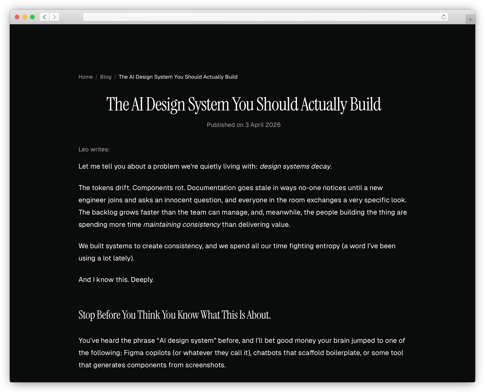

<p align="center">
  
</p>

<h1 align="center">mrlemoos.dev</h1>

<p align="center">
  Personal portfolio and blog — Astro, TypeScript, and Tailwind CSS — deployed on Vercel.
</p>

## About

Source for [mrlemoos.dev](https://mrlemoos.dev): a prerendered portfolio with a content-driven blog. Posts live in Astro content collections under `src/content/blog`; MDX supports maths via remark-math and rehype-katex. Typography uses Geist for body and UI, Instrument Serif for headings, with a grey-first palette and light motion for a calm, editorial feel.

## Features

- Astro 6 with the Vercel adapter (`@astrojs/vercel`), hybrid/server output and dynamic routes where needed
- Blog and MDX with KaTeX-ready markdown pipeline
- Tailwind CSS v4 via the Vite plugin
- Dynamic Open Graph images (`@vercel/og`)
- Sitemap integration (`@astrojs/sitemap`)
- TypeScript and ESLint

## Tech stack

| Area        | Choice                                      |
| ----------- | ------------------------------------------- |
| Framework   | Astro 6                                     |
| Language    | TypeScript                                  |
| Styling     | Tailwind CSS v4, `@tailwindcss/typography`  |
| Content     | MDX, Astro content collections              |
| Fonts       | Geist Sans / Mono, Instrument Serif (npm)   |
| Analytics   | Vercel Analytics                            |
| Deployment  | Vercel                                      |

## Prerequisites

- Node.js 24.x or newer
- [pnpm](https://pnpm.io/) (version pinned in `package.json`)

## Getting started

```bash
git clone https://github.com/mrlemoos/mrlemoos.dev.git && cd mrlemoos.dev
pnpm install
pnpm dev
```

Open [http://localhost:4321](http://localhost:4321) (Astro’s default dev port).

## Scripts

| Command       | Description              |
| ------------- | ------------------------ |
| `pnpm dev`    | Start Astro dev server   |
| `pnpm build`  | Production build         |
| `pnpm preview`| Preview production build |
| `pnpm lint`   | Run ESLint               |
| `pnpm check`  | Run `astro check`        |

## Project structure

```
src/
├── content/blog/     # MDX posts (content collections)
├── pages/            # Routes (including `og` route)
├── layouts/          # Page shells
├── components/       # Astro components
├── lib/              # SEO, OG image, data, helpers
└── styles/           # Global CSS
```

## Customisation

- Site URL and build options: `astro.config.mjs`
- New posts: add MDX under `src/content/blog/` and match the collection schema in `content.config.ts`
- Shared layout and metadata: `src/layouts/BaseLayout.astro`, `src/lib/seo.ts`
- Home and listing pages: `src/pages/index.astro`, `src/pages/blog/`

## Contributing

Contributions are welcome. Please open a pull request with a short description of the change.

## Licence

Apache License 2.0 — see [LICENSE](LICENSE).

## Acknowledgments

- [Astro](https://astro.build/)
- [Tailwind CSS](https://tailwindcss.com/)
- [Vercel](https://vercel.com/)
